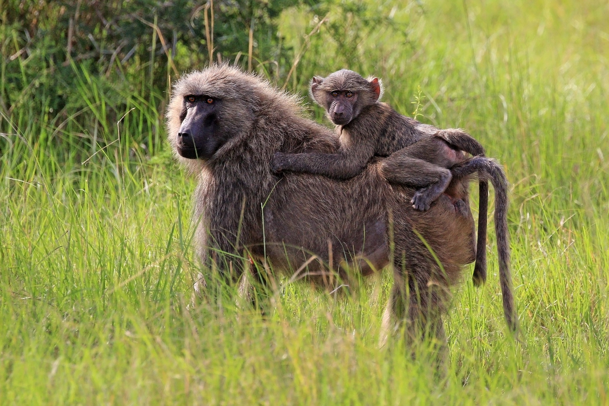

<!-- Banner -->
<section id="banner">

<h2>{{ site.title }}</h2>

{{ site.description | markdownify }}

	<ul class="actions special">
		<li><a href="joinus.html" class="button special">Ph.D. position available</a></li>
	</ul>

<a href="#one" class="more scrolly">Learn More</a>
</section>

<!-- One -->
<section id="one" class="wrapper style1 special">

<header class="major">
<h2>A research group at the  Bioinformatics Centre, Aarhus University</h2>

We use population genomic analysis and modelling to address the fundamental mechanisms of evolution  - with  a special affinity for the unique role of sex chromosomes and meiotic drive.

</header>

	<ul class="icons major">
	<li><a href="people.html" style="border-bottom-color: transparent;">People</a></li>
	<li><a href="http://www.birc.au.dk" style="border-bottom-color: transparent;">Aarhus University</a></li>
	<li><a href="mailto:kaspermunch@birc.au.dk" style="border-bottom-color: transparent;">Email</a></li>
	</ul>

</section>

<!-- Two -->
<section id="two" class="wrapper alt style2">
<section class="spotlight">

<h2>Research</h2>
We work on how selection and recombination together shape genetic variation, the evolution of genomes, and the formation of new species. <a href="research.html">Read more here.</a>

</section>
<section class="spotlight">

<h2>Software</h2>
We make computational approaches available as web servers, scientific software, or programming libraries. <a href="software.html">Read more here.</a>

</section>
<section class="spotlight">

<h2>Science posts from the group</h2>
We strive to present our findings in a way accessible to wider audience. <a href="popular_science.html">Read more here.</a>

</section>
</section>

<!-- Three -->
<section id="three" class="wrapper style3 special">

<header class="major">
<h2>Publications</h2>

See the full list of publications from the group <a href="publications.html">here</a> and some recent ones below.

</header>
<ul class="features">
<li class="icon fa-newspaper-o">
<h3>Comparison of the full distribution of fitness effects of new amino acid mutations across great apes</h3>
Read it in <a href="https://www.genetics.org/content/213/3/953.full">Genetics</a>.
</li>
<li class="icon fa-newspaper-o">
<h3>Impact of mutation rate and selection at linked sites on DNA variation across the genomes of humans and other homininae</h3>
Read it in <a href="https://academic.oup.com/gbe/advance-article/doi/10.1093/gbe/evz215/5584269">Genome Biology and Evolution</a>.
</li>
</ul>

</section>

<!-- CTA -->
<section id="cta" class="wrapper style4">

<header>
<h2>News</h2>

News from the group - big and small

</header>
<ul class="actions vertical">
<li></li>
<li><a href="news.html" class="button fit">View News</a></li>
</ul>

</section>
