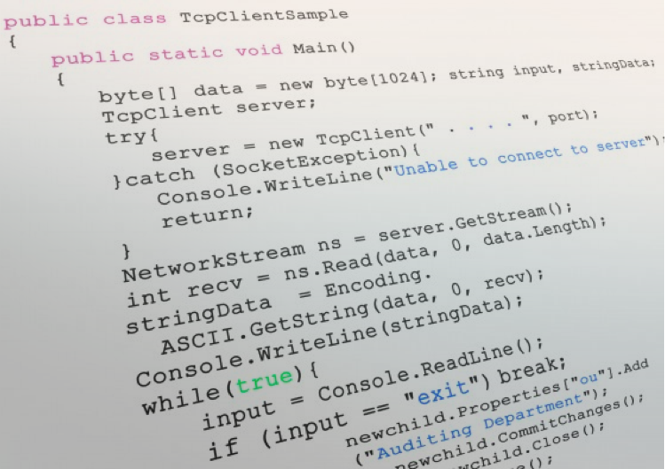

<!-- Banner -->
<section id="banner">

<h2>{{ site.title }}</h2>

{{ site.description | markdownify }}

<a href="#one" class="more scrolly">Learn More</a>
</section>

<!-- One -->
<section id="one" class="wrapper style1 special">

<header class="major">
<h2>A research group at the Bioinformatics Centre, Aarhus University</h2>

We use population genomic analysis and modelling to address the fundamental mechanisms of evolution  - with  a special affinity for the unique role of sex chromosomes and meiotic drive.

</header>

							<ul class="icons major">
								<li><a href="people.html"></a>Lorem
                                </li>
								<li>Ipsum</li>
								<li>Dolor</li>
							</ul>

</section>

<!-- Two -->
<section id="two" class="wrapper alt style2">
<section class="spotlight">

<h2>Research</h2>
Our goal is to understand how mutation, selection and recombination together shape genetic variation, the evolution of genomes and the formation of new species. Most of our research is on humans and primates. <a href="research.html">Read more here.</a>

</section>
<section class="spotlight">

<h2>Software</h2>
When our computational approaches are usefull as tools for other researchers, we make them available as web servers, scientific software, or programming libraries. <a href="software.html">Read more here.</a>

</section>
<section class="spotlight">

<h2>Science for everyone</h2>
Whenever we publish new results in journals, we strive to also present our findings in a way that is accessible the general public - often in the form of a blog post on these pages. <a href="popular_science.html">Read more here.</a>

</section>
</section>

<!-- Three -->
<section id="three" class="wrapper style3 special">

<header class="major">
<h2>Publications</h2>

See the full list of publications from the group <a href="publications.html">here</a> and some recent ones below.

</header>
<ul class="features">
<li class="icon fa-newspaper-o">
<h3>The comparative genomics and complex population history of <em>Papio</em> baboons</h3>
Read it in <a href="http://advances.sciencemag.org/content/5/1/eaau6947">Science Advances</a>.
</li>
<li class="icon fa-newspaper-o">
<h3>A comprehensive genomic history of extinct and living elephants</h3>
Read it in <a href="https://www.pnas.org/content/115/11/E2566">PNAS</a>.
</li>
</ul>

</section>

<!-- CTA -->
<section id="cta" class="wrapper style4">

<header>
<h2>News</h2>

News from the group - big and small

</header>
<ul class="actions vertical">
<li></li>
<li><a href="news.html" class="button fit">View News</a></li>
</ul>

</section>