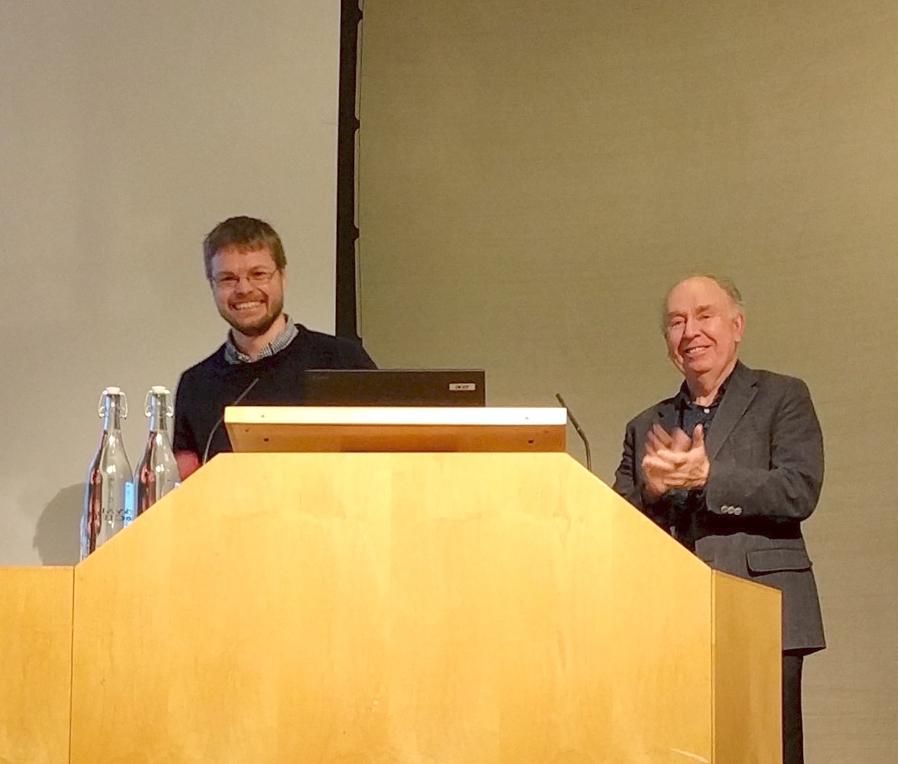
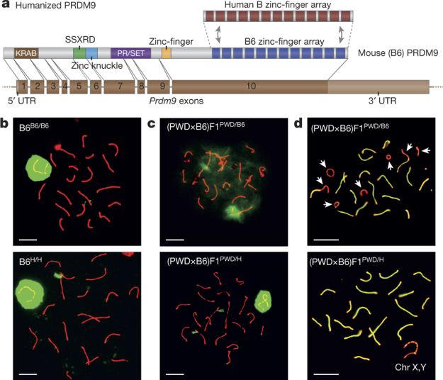
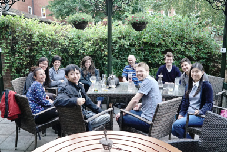
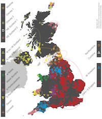
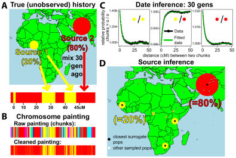

## 12th September

Simon will be giving a keynote presentation at the [The Students and Postdocs Meiosis Workshop](https://congress.igh.cnrs.fr/PDSM2018/) in Montpellier, France on the 12th of September.

## 22nd August 2018

Postdoc opportunity in statistical and population genetics at University of Oxford. 
Closing date: 17th September 2018

We are currently advertising for a postdoctoral researcher in Statistical and Population Genetics at the University of Oxford’s Department of Statistics. Supervisory support will be jointly provided by Simon Myers and Jonathan Marchini (Oxford) and Dr Garrett Hellenthal (UCL). The post is for 18 months.
For informal queries contact Simon Myers ([myers@stats.ox.ac.uk](myers@stats.ox.ac.uk)). Full details at [http://www.stats.ox.ac.uk/vacancies/](http://www.stats.ox.ac.uk/vacancies/).

## 12th March 2018
Clare's paper on fine-scale population structure in Spain is now avaliable on bioRxiv [doi.org/10.1101/250191](https://doi.org/10.1101/250191).

## 6th February 2018
Clare and Simon have been working with Oxford Sparks to create an animation about their work on fine scale population structure as part of a special exhibition at the University of Oxford Museum of Natural History. You can watch the animation at [youtube.com/watch?v=G6bNXdwEA84](https://www.youtube.com/watch?v=G6bNXdwEA84) and find out more about the Settlers exhbition at [oum.ox.ac.uk/settlers/](http://www.oum.ox.ac.uk/settlers/).

## 29th January 2018
Wellcome to Chris Cole who is joining the group for a rotation project as part of the Genomic Medicine and Statistics DPhil course.

## 3 Jan 2018
A number of our group are going to the [51st Population Genetics Group Meeting](http://populationgeneticsgroup.org.uk) this week in Bristol. Leo will be giving a presentation on "A method for estimating genome-wide genealogies for thousands of samples", and Jeffery will be presenting his previous post-doc work: "A numerical solution of the Wright-Fisher SDE with application to transition probability density approximation".

## 15 December 2017
We went out for lunch this week to mark the departure of Ran who is off to do a second postdoc in the Ratcliffe group, Oxford.

## 06 December 2017

Simon delivered the Francis Crick lecture at the Royal Society on "The birth of a new species: Bringing together, yet driving apart". ([more details](https://royalsociety.org/science-events-and-lectures/2017/12/francis-crick-lecture/)). If you missed it you can watch it on the Royal Societies YouTube channel [here](https://www.youtube.com/watch?v=gKq-lIjP3BM)!

Image: Simon receiving his commemorative scroll from Sir John Skehel. (Daniel Wells [CC-BY 4.0](https://creativecommons.org/licenses/by/4.0/legalcode))

## 27 November 2017
Congratulations to Clare for passing her PhD viva this week!

## 26 October 2017
Our paper on "A map of human PRDM9 binding provides evidence for novel behaviors of PRDM9 and other zinc-finger proteins in meiosis" is now published in [Elife](https://doi.org/10.7554/eLife.28383).

## 27 August 2017
This week a number of us will be at the [EMBO conference on Meiosis](https://embo16-meiosis.irb.hr) in Croatia.

## 31 May 2017
Nick's paper "Human PRDM9 Can Bind And Activate Promoters, And Other Zinc-Finger Proteins Associate With Reduced Recombination In cis" is now [available on bioRxiv](https://doi.org/10.1101/144295)!

## 18 July 2016.
Breaking news is that Simon has been awarded the 2017 [Francis Crick Medal and Lecture](https://royalsociety.org/grants-schemes-awards/awards/francis-crick-lecture/) by the Royal Society “for transforming our understanding of meiotic recombination and of human population history. ” The prize lecture will be delivered in December 2017.

This prestigious prize is a great recognition of the contribution that Simon is making to understanding key aspects of genetics.

## 04 July 2016.
Robbie and Simon (along with coauthors) have published a Nature Genetics paper detailing the STITCH method for [Rapid genotype imputation from sequence without reference panels](http://www.nature.com/ng/journal/vaop/ncurrent/full/ng.3594.html). This method allows for imputation based only on sequencing read data, without requiring additional reference panels or array data. The approach is accurate even in settings of extremely low sequencing coverage. For example, accurate imputation of 5.7 million SNPs at a mean r2 value of 0.98 in 2,073 outbred laboratory mice is achieved (0.15× sequencing coverage). In a related paper, also in Nature Genetics today, STITCH is used to do [Genome-wide association of multiple complex traits in outbred mice](http://www.nature.com/ng/journal/vaop/ncurrent/full/ng.3595.html).

## 15 April 2016.
We are hiring! There are [2 positions in Statistical Genetics Methods Development](http://tinyurl.com/hy8gd7v) and  [1 position in Statistical Genetics Software Development](http://tinyurl.com/z3w3ttb). The full-time positions are funded by the Wellcome Trust and are fixed-term for 3 years. These positions will focus on analysing data gathered by Genomics England (GEL). GEL will deep sequence the complete genomes of approximately 70,000 individuals, sampled across diverse rare disease phenotypes, cancer patients, and healthy individuals. Funding is via a Wellcome Trust Collaborative Award, and these positions will be supervised jointly by Prof Myers and [Prof Jonathan Marchini](https://jmarchini.wordpress.com/).

The closing date for applications is 1 June 2016.

## 23 February 2016.
The 2nd [Probabilistic Modeling in Genomics Conference](http://www.stats.ox.ac.uk/events/probgen16) (ProbGen16), will be held at the Department of Statistics, University of Oxford, UK.

Monday 12th September – Wednesday 14th September 2016

Organisers: Jonathan Marchini, University of Oxford, UK; Simon Myers, University of Oxford, UK; Jotun Hein, University of Oxford, UK; Peter Ralph, University of South California, USA

## 11 February 2016.

A study by a team including 5 members of the Myers Group has published a paper in [Nature](http://www.nature.com/nature/journal/v530/n7589/full/nature16931.html) that shows the role the PRDM9 gene plays in speciation. This was achieved by completely restoring fertility in normally infertile hybrids of two mouse subspecies, by the insertion of a human equivalent of the PRDM9 gene.

## 16 November 2015.
Robbie is writing up his DPhil thesis and has found employment! He will be working with [Genomics plc](http://www.genomicsplc.com/) in Oxford as a Statistical Bioinformatician / Geneticist.

## 15 July 2015.

We had burgers and a few beers to mark the departure of Nick this week. Nick is off to do a second PhD in Bioengineering at UC Berkeley.

## March 2015.

The People of the British Isles paper appeared in [Nature](http://www.nature.com/nature/journal/v519/n7543/full/nature14230.html). This paper leverages some of the recent work done by the Myers group and “shows that subtle variations in the genetic make-up of modern Britons reflect the history of their islands’ colonisation by peoples from mainland Europe since the last Ice Age.” (credit: Wellcome Trust Centre for Human Genetics)

## February 2014.

“A genetic atlas of human admixture history” appeared in [Science](http://www.sciencemag.org/content/343/6172/747). In this study, which attracted considerable press attention, we developed and applied to a large dataset of 1500 individuals from 94 populations, a model-based approach to identify, and date, mixing events among human populations. The work is the first to describe, in detail, how the DNA of most humans is affected by such events, and discovers impacts on our DNA of recorded historical events, e.g. the Mongol empire.
