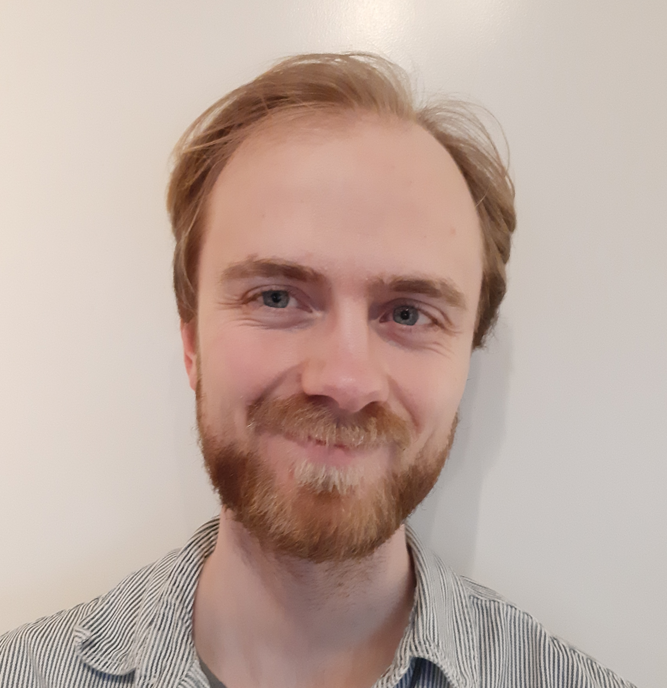
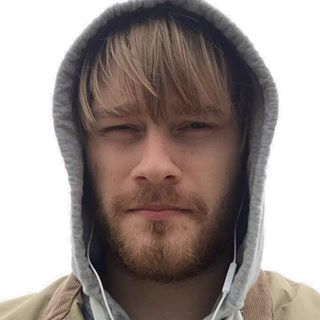

<header>
    <h3>Kasper Munch</h3>
    
PI

</header>

Applies population genomic analysis and modelling to understand the fundamental properties and mechanisms of selection, recombination, and speciation. Model organisms are mostly humans and other primates.

[ORCID Profile](https://orcid.org/0000-0003-2880-6252) - 
[kaspermunch@birc.au.dk](mailto:kaspermunch@birc.au.dk)

<header>
    <h3>PhD student: </h3>
    
PhD student

</header>

Erik is a new PhD student in the group. He plans to work on how intragenomic confilics shape genome evolution and development of hybrid incompatibilties between diverging populations.

## Former members

<header>
    <h3>Tobias Røikjer</h3>
    
MSc student

</header>

Tobias works on a graph-based formulation of phase-type distributions to compute the joint distribution of total branch length of lineages with different numbers of descendants and to compute the joint distribution of the site frequency spectrum in both a single population and in an isolation -with-migration model.

<header>
    <h3>Postdoc: David Castellano</h3>
    
Postdoc

</header>

 David was funded by Independent Research Fund Denmark. He worked on distributions of fitness effects and the determinants of genetic variation across the genomes of great apes. David went on to do a postod with Donate Weghorn, Centre for Genomic Regulation, Spain.

[ORCID Profile](https://orcid.org/0000-0001-8778-6007)

<header>
    <h3>Jonas Berglund</h3>
    
Postdoc

</header>

 Jonas worked on GC-biased gene conversion and stability of hotspots in birds. He went on to do a postdoc at Department of Ecology and Genetics, Evolutionary Biology in Uppsala 

[ORCID Profile](http://orcid.org/)