## [Prof. Simon Myers:](http://www.stats.ox.ac.uk/~myers/)

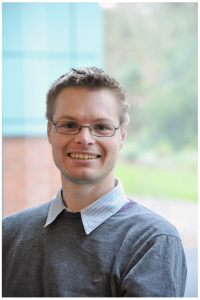

Our group is based jointly at the [Department of Statistics](https://www.stats.ox.ac.uk), and the [Wellcome Trust Centre for Human Genetics](https://www.well.ox.ac.uk). We are broadly interested in answering questions in statistical, population, and medical genetics. We develop and apply model-based computational techniques, and perform lab-based research. One strong focus of the groups’ research is the study of the basic biological process of recombination, and its links to fertility and health in mammals. A second focus is inference of  fine-scale population structure – within individual countries – and the genetic impacts of migration events, in humans and other species.

[CV](http://www.stats.ox.ac.uk/~myers/CV.docx) - 
[ORCID Profile](http://orcid.org/0000-0002-2585-9626) - 
[myers@stats.ox.ac.uk](mailto:myers@stats.ox.ac.uk)

## [Dr Ran Li:](https://www.stats.ox.ac.uk/people/research_staff/ran_li)

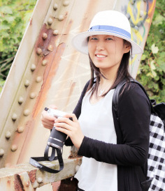

I am a postdoc working on the resolution of recombination. Meiotic recombination is initiated by programmed DNA double strand breaks, which can resolve as crossovers (COs) or as non-crossover gene conversions (NCO). Although most DSB’s resolve as NCO’s, many basic properties of these events remain uncertain, because short NCO tracts are often difficult to detect.

We have studied this process using data from mice, greatly increasing our power to detect NCO’s in an unbiased fashion. A particular focus is the impact of the variability and binding of the DNA-binding protein PRDM9, a gene the Myers lab [previously identified](http://www.ncbi.nlm.nih.gov/pmc/articles/PMC3828505/) as controlling recombination positioning in humans and other mammals, on these events.

[ranli@well.ox.ac.uk](mailto:ranli@well.ox.ac.uk)

## Dr Emmanuelle Bitoun:

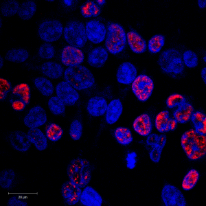

I am a postdoc performing experimental lab-based research to study recombination, and its links to speciation, in mammals. I leverage a variety of experimental techniques including ChIP-Seq, fertility assays, transfection, and the investigation of protein-protein interactions.

[ebitoun@well.ox.ac.uk](mailto:ebitoun@well.ox.ac.uk)

## [Dr Zhangyi He:](http://users.ox.ac.uk/~stat0304/)

I am a postdoc working on the Wellcome-Trust funded project: “Building a platform for genetic inference from the Genomics England data”, supervised by Professor Jonathan Marchini and Professor Simon Myers. During the 3-year lifetime of this project, Genomics England (GEL) will deeply sequence 100,000 complete human genomes from approximately 70,000 individuals, sampled across a range of rare disease phenotypes, cancer patients, and healthy individuals. We are responsible for leading the development and implementation of new statistical analysis tools, enabling the research community to leverage the GEL data in studies of human phenotypes, by allowing phasing and imputation of extremely low frequency variants. Within the same unified analysis framework, we will also develop approaches to characterize the fine-scale genetic structure of the English population at an unprecedented level, providing knowledge for population structure matching and adjustment for such phenotypic studies.

[zhangyi.he@stats.ox.ac.uk](mailto:zhangyi.he@stats.ox.ac.uk)

## [Dr Sile Hu:](http://users.ox.ac.uk/~stat0311/)

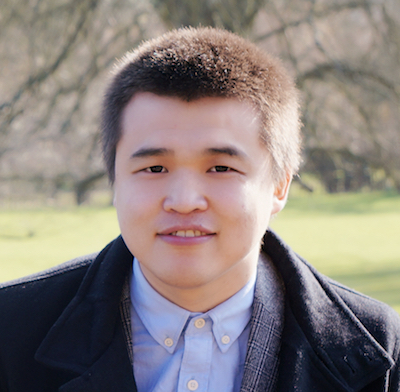

I am a postdoc working on “Building a platform for genetic inference from the Genomics England data”. I am co-supervised by Prof. Jonathan Marchini and Dr Garrett Hellenthal.

[sile.hu@stats.ox.ac.uk](mailto:sile.hu@stats.ox.ac.uk)

## Dr Sinan Shi:

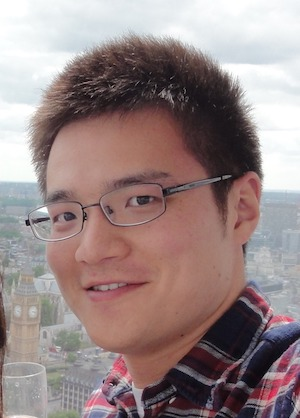

I am a postdoctoral research programmer working on “Building a platform for genetic inference from the Genomics England data”. I am cosupervised by Prof. Jonathan Marchini and Dr. Garrett Hellenthal.

[sinan.shi@stats.ox.ac.uk](mailto:sinan.shi@stats.ox.ac.uk)

## Yunli Song:

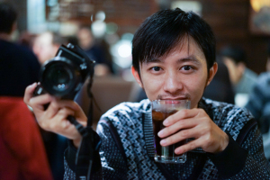

I am a DPhil student working on the detection and genotyping of variable minisatellites from high-throughput sequencing data. A minisatellite region consists of tandem repeats that range in length from 10 to over 100 bp. Hypermutable minisatellites have been shown to exist at the locations of recombination hotspots, but in general the extent to which other minisatellite harbour variation is not well characterized. We aim to find novel variation, and identify the drivers of minisatellite instability.

[yunli.song@stats.ox.ac.uk](mailto:yunli.song@stats.ox.ac.uk)

## Clare Bycroft:

I am a DPhil student interested in shedding light on demographic history by studying patterns of genetic variation. The Iberian Peninsula has undergone a complex history of population isolation, migrations and invasions from other regions, such as North Africa and parts of Europe. I am applying powerful haplotype-based statistical methods to detect and explain the population genetic structure of Spain. Characterising and quantifying the genetic impact of demographic events involving populations from outside of the Peninsula is also a key focus of my research. The Iberian Peninsula provides a unique opportunity to test new admixture models in a setting which involves complex admixture events among relatively closely-related populations.

[clare@well.ox.ac.uk](mailto:clare@well.ox.ac.uk)

## [Daniel Wells:](http://www.danielwells.me)

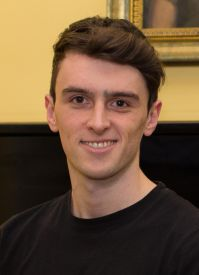

I am a DPhil student investigating patterns of gene expression in meiosis. This process is a type of cell division which produces sperm and egg cells and is critical to the evolution, fertility, and speciation of sexually reproducing organisms. Resolving the full gene expression profile of meiosis should help to identify the genes involved in meiosis and thence the mechanisms and regulatory processes.

Previously I completed an integrated masters degree in biochemistry at the University of Oxford and two computational rotation projects as part of my first year in the genomic medicine and statistics DPhil programme.

[wells@stats.ox.ac.uk](mailto:wells@stats.ox.ac.uk)

## [Christopher C. Gill:](http://www.stats.ox.ac.uk/~gill/)

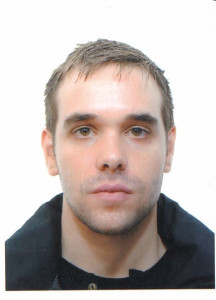

I am working with the ancestry company [LivingDNA](https://www.livingdna.com/). This is part of the Systems Approaches to Biomedical Sciences ([SABS](http://www.sabsidc.ox.ac.uk/)) doctoral program. I am currently interested in developing statistical tools and pipelines to provide new insights into genetic ancestry estimation.

Having completed my degree in 2006, covering a wide range of mathematical topics, I went on to complete a D.Phil, focussing on the representation theory of finite groups. Much of my time was spent studying questions related to the decomposition numbers. More specifically, I studied properties of Young modules, an important aspect of the representation theory of the symmetric group, and more generally trivial source modules for finite groups. I spent several years pursuing research in this area, whilst enjoying a considerable amount of teaching. I held positions at Charles University in Prague, and at Somerville College and Keble College in Oxford. In 2015 I decided to pursue a more interdisciplinary approach to research in the biological/biomedical setting.

[gill@stats.ox.ac.uk](mailto:gill@stats.ox.ac.uk)

## [Leo Speidel:](https://leospeidel.wordpress.com/)

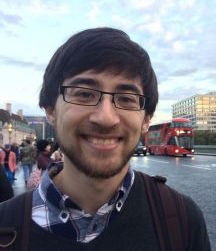

I am a DPhil student working on inference of most-recent common ancestor (MRCA) relationships between DNA sequences (genealogy). Humans have 22 homologous pairs of chromosomes; each pair consists of one maternally and one paternally inherited chromosome. When DNA is passed on to an offspring, homologous chromosomes of a parent can undergo recombination. In this process, a single new chromosome is formed inheriting DNA of both homologous chromosomes. Ancestry may differ for each homologous chromosome and MRCA relationships may therefore change along the newly formed chromosome. We are developing a method that infers a sequence of (rooted) binary trees, where each tree specifies genealogy of a subregion on the chromosome.

I studied Mathematics at the LMU Munich and did a masters in Mathematical Informatics at the University of Tokyo. I am also interested in networks/graphs and dynamical systems on top of them, such as epidemic models.

[leo.speidel@outlook.com](mailto:leo.speidel@outlook.com)

## Alumni

## [Dr. Michael Salter-Townshend:](https://sites.google.com/site/mikesaltertownshend/)

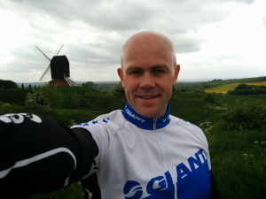

I am a postdoc investigating “admixture events” between human populations. These occur when two or more previously separated populations come together, leading to individuals carrying a mixture of ancestries. Specifically, I am developing a new approach to allow identification of individual ancestry segments within such individuals, inferring the nature of the events – including the groups which mixed – without prior knowledge. I’m also a Junior Research Fellow at [Mansfield College](https://www.mansfield.ox.ac.uk/).

## [Anna Frangou:](https://uk.linkedin.com/in/anna-frangou-a2b03b65)

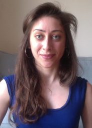

Anna completed her D.Phil on the the topic of ["Using genealogical trees to examine admixture between modern humans and Neandertals"](https://ora.ox.ac.uk/objects/uuid:ca235cb7-4d90-41d6-ad3d-0883567783a1). She is now a bioinformatician in cancer genomics at the Big Data Institute.

I am a DPhil student working on understanding the genetic relationships between modern humans and Neandertals, using whole genome data, specifically the nature of admixture (interbreeding) between the two species. We use a novel method – CEPHi – developed by Marie Forest.

CEPHi provides genealogical trees, using which we can directly observe region-specific relationships between Neandertal and human haplotypes. By extending CEPHi, we have been able to study the joint population size histories of the human and Neandertal populations before and after they split, the split time and the time of admixture between the species, and the extent to which European, Asian and other populations share the same Neandertal admixture.

[anna.frangou@dtc.ox.ac.uk](mailto:anna.frangou@dtc.ox.ac.uk)

## [Nick Altemose:](http://streetslab.berkeley.edu/people/nicolas-altemose/)

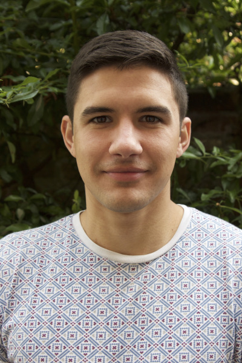

Nick completed his D.Phil on the topic of ["Novel genetic and molecular properties of meiotic recombination protein PRDM9"](http://solo.bodleian.ox.ac.uk/OXVU1:LSCOP_OX:oxfaleph020646080).

I grew up in California and studied computational Biology at Duke University before doing my DPhil in the Myers group at Oxford. My DPhil project involved applying experimental and computational methods to characterize the catalytic and DNA-binding properties of PRDM9, a rapidly evolving meiotic protein that determines the locations of recombination hotspots in the human genome and influences genome evolution, fertility, and speciation. Now I’m pursuing a second PhD, this time in Bioengineering, at UC Berkeley.

## [Robert Davies:](https://twitter.com/robbie_stats)

Robbie completed his D.Phil as part of the Genomic Medicine and Statistics programme on the topic of ["Factors influencing genetic variation in wild mice"](https://ora.ox.ac.uk/objects/uuid:ced6a42f-66f5-4001-aaf8-8059d5fcfe27) (2011-2015) He is now a Research Fellow at The Hospital for Sick Children.

## Thaddeus Aid:

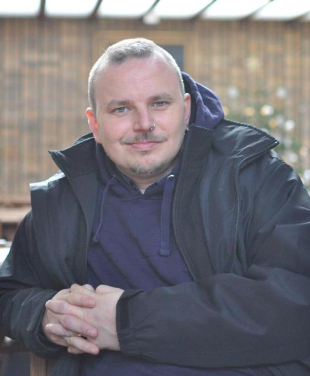

I am an MPhil student working on identifying evidence of human mutations influenced by natural selection, by building genealogical trees genome-wide for a set of groups sequenced as part of the 1000 genomes project.

## [Marie Forest:](https://ca.linkedin.com/in/marie-forest-73a94986)

Marie completed her D.Phil on the topic of “Simultaneous estimation of population size changes and splits times using importance sampling” [ORA Link](https://ora.ox.ac.uk/objects/uuid:8c067a3d-44d5-468a-beb5-34c5830998c4) (2011-2014). She is now a postdoctoral fellow at McGill University.

## [Afidalina Tumian:](https://twitter.com/drafidalina)

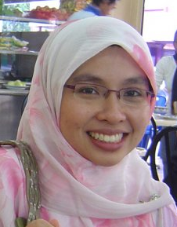

Afidalina completed her D.Phil on the topic of [“The Evolution of Recombination Hotspots and Their Relationship with DNA Sequences”](http://solo.bodleian.ox.ac.uk/OXVU1:LSCOP_OX:oxfaleph020406020) (2008-2012). She is now Assistant Professor at International Islamic University Malaysia.

## [Nudrat Noor:](http://projects.iq.harvard.edu/james-toddlab/people/nudrat-noor-ms-phd)

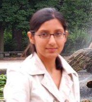

Nudrat completed her D.Phil on the topic of [“Molecular Mechanisms of Recombination Hotspots in Humans”](https://ora.ox.ac.uk/objects/uuid:dd26a44a-e190-42e3-b90f-d00269f8a7b4) (2010-2013). She is now a Postdoctoral Fellow at Harvard T.H. Chan School of Public Health.

## [Anjali Gupta Hinch:](http://www.well.ox.ac.uk/anjali-gupta-hinch)

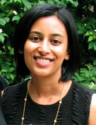

Anjali completed her D.Phil as part of the Genomic Medicine and Statistics programme on the topic of [“The landscape of recombination in African Americans : leveraging human population variation to investigate homologous recombination”](http://solo.bodleian.ox.ac.uk/OXVU1:LSCOP_OX:oxfaleph020397818) (2010-2013). She is now a post-doc in Prof. Peter Donnelly's group
