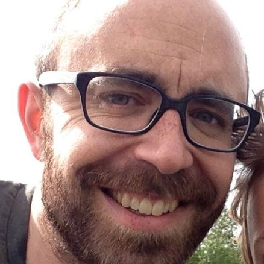
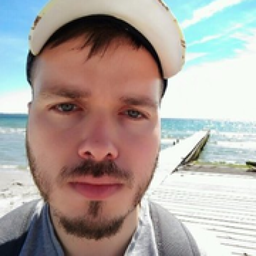
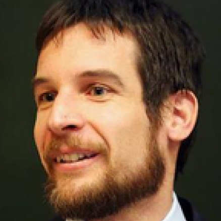

## Kasper Munch - Associate professor 

 Associate professor at the Bioinformatics Research Centre (BiRC) at Aarhus University. Most research use population genomics approaches to understand the fundamental properties and mechanisms of selection, recombination, and speciation. Most work is done on great apes and other primates.

[CV]() - 
[ORCID Profile](http://orcid.org/) - 
[kaspermunch@birc.au.dk](mailto:kaspermunch@birc.au.dk)

## Alumni

## David Castellano - Postdoc

 David was funded by Independent Research Fund Denmark. Worked on distributions of fitness effects and the determinants of genetic across the genomes of great apes. David went on to do a postod with Donate Weghorn, Centre for Genomic Regulation, Spain.

[ORCID Profile](https://orcid.org/0000-0001-8778-6007)

## Jonas Berglund - Postdoc

 Worked on GC-biased gene conversion and recombination induce mutation at bird hotspots. Jonas is now a postdoc at Department of Ecology and Genetics, Evolutionary Biology in Uppsala 

[ORCID Profile](http://orcid.org/)